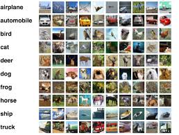

# Cifar10

1. The CIFAR-10 dataset (Canadian Institute For Advanced Research) is a collection of images that are commonly used to train      machine learning and computer vision algorithms.
2. It is one of the most widely used datasets for machine learning research. The CIFAR-10 dataset contains 60,000 32x32 color      images in 10 different classes.
3. The 10 different classes represent airplanes, cars, birds, cats, deer, dogs, frogs, horses, ships, and trucks. There are        6,000 images of each class.
4. Computer algorithms for recognizing objects in photos often learn by example. CIFAR-10 is a set of images that can be used      to teach a computer how to recognize objects.
5. Since the images in CIFAR-10 are low-resolution (32x32), this dataset can allow researchers to quickly try different            algorithms to see what works. Various kinds of convolutional neural networks tend to be the best at recognizing the images      in CIFAR-10.
6. CIFAR-10 is a labeled subset of the 80 million tiny images dataset. When the dataset was created, students were paid to        label all of the images.

#Dataset

